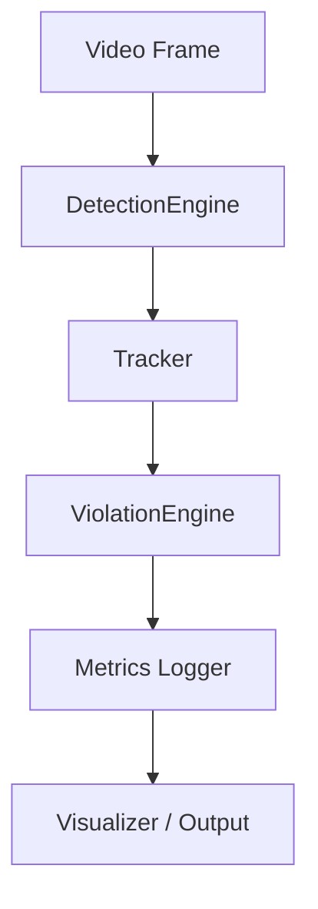

# 🧠 Traffyx-AI (v1.0)
## A Real-Time Computer Vision Pipeline for Traffic Analysis

> Traffyx-AI is a real-time computer vision system that detects, tracks, and evaluates traffic entities from video streams, producing measurable performance metrics and rule-based decisions suitable for edge deployment.

---

## 🏷️ Badges

<div align="center">


</div>

---

## 🎯 The Problem (v1.0 Focus)

Many traffic analytics systems are over-engineered for demos but are fragile in real-world pipelines. They are often opaque in performance, with no clear visibility into latency or FPS, and are not designed with edge computing constraints in mind.

**Traffyx-AI v1.0 focuses on engineering correctness, observability, and pipeline realism.** It serves as a robust foundation for building advanced traffic intelligence systems.

---

## ✅ v1.0 Scope

This version establishes a stable, performant, and observable core pipeline.

### What's in v1.0:
- ✅ **Offline Video Input:** Process standard `.mp4` video files.
- ✅ **Object Detection:** Frame-level detection of vehicles and pedestrians using YOLOv8.
- ✅ **Multi-Object Tracking:** Assign and maintain stable IDs for objects across frames using ByteTrack.
- ✅ **Rule-Based Logic:** A basic engine for implementing time-based rules (e.g., object counting, zone entry).
- ✅ **Performance Instrumentation:** Built-in logging for FPS, latency, and memory usage.
- ✅ **CLI-Based Operation:** A command-line interface for running the pipeline.
- ✅ **Visualized Output:** Generates an annotated video with bounding boxes, track IDs, and performance metrics.
- ✅ **Structured Logs:** Outputs JSON logs for detections, tracks, and rule triggers.

### What's Explicitly Excluded from v1.0:
- ❌ Live RTSP stream processing
- ❌ Multi-camera fusion or Re-Identification (Re-ID)
- ❌ Cloud orchestration or deployment
- ❌ Model training or fine-tuning
- ❌ Web-based UI dashboards
- ❌ Alerting or notification systems
- ❌ Database persistence for events

---

## 🏗️ v1.0 Architecture

The v1.0 architecture is a **strict, linear pipeline** designed for clarity and performance measurement. Each stage processes data and passes it to the next.

### High-Level Pipeline


### Module Responsibilities

| Module            | Responsibility                                                              | State     |
| ----------------- | --------------------------------------------------------------------------- | --------- |
| **DetectionEngine** | Loads model, runs inference on frames, filters detections.                  | Stateless |
| **Tracker**         | Assigns persistent IDs, manages track lifecycle (entry, exit, occlusion).   | Stateful  |
| **ViolationEngine** | Applies time-based rules to tracks, triggers events, suppresses duplicates. | Stateful  |
| **Metrics Logger**  | Measures latency, FPS, and memory usage per stage.                          | Stateless |
| **Runner/Pipeline** | Orchestrates the flow of data through the pipeline.                         | Stateless |

> **Architectural Rule:** A module's statefulness is fixed. A stateless module storing state is a design violation.

---

## 📥 Inputs & 📤 Outputs

The system has a clearly defined I/O contract for v1.0.

- **Input:**
  1.  A video file (e.g., `data/sample.mp4`).
  2.  A configuration file (`params.yaml`) for all thresholds and settings.

- **Output:**
  1.  An annotated output video file.
  2.  Structured JSON logs for:
      -   `detections.json`
      -   `tracks.json`
      -   `events.json`
      -   `performance.json`

---

## 🛠️ Tech Stack
### Core
- Python 3.9+
- OpenCV
- NumPy

### AI / ML
- YOLOv8 (Ultralytics)
- PyTorch
- ByteTrack

### Configuration
- PyYAML

  ---
  
## 📂 Project Structure
```
UrbanEye/
├── data/                  # Sample videos & datasets
├── models/                # YOLO & Re-ID model weights
├── src/
│   ├── detection/         # Object detection pipeline
│   ├── tracking/          # Multi-object tracking
│   ├── violations/        # Speed & helmet logic
│   ├── reid/              # Vehicle re-identification
│   ├── dashboard/         # Web UI
│   └── utils/             # Helper utilities
├── notebooks/             # Experiments & analysis
├── docker/                # Docker configuration
├── requirements.txt
└── README.md
```

---

## 💻 Installation
### Clone the Repository
```bash
git clone https://github.com/yourusername/UrbanEye.git
cd UrbanEye
```

### Create Virtual Environment
```bash
python -m venv venv
source venv/bin/activate    # Windows: venv\Scripts\activate
```

### Install Dependencies
```bash
pip install -r requirements.txt
```

### Download Model Weights
Download YOLOv8 weights and place them inside:
```bash
models/
```

### ▶️ Usage
### Run Detection Pipeline
``` bash
python src/detection/run_inference.py --video data/sample.mp4
```

### Start Dashboard
```bash
python src/dashboard/app.py
```

### Test Speed Estimation
```bash
python src/violations/speed_test.py
```

## ⚙️ Performance & Hardware
### Tested On:
- Lenovo LOQ
- NVIDIA RTX 4060 (8GB)
- 24GB RAM

| Metric          | Value        |
| --------------- | ------------ |
| Inference Speed | 30–45 FPS    |
| GPU Memory      | 4–6 GB       |
| Latency         | < 100 ms     |
| Deployment      | Edge / Local |

### 📈 Real-World Metrics (v1.0)

Performance is measured per-frame and logged to `logs/*.jsonl`.

<div align="center">
  
  
</div>

*To reproduce these charts, run `python scripts/plot_metrics.py` after processing a video.*

## 📊 Benchmarks

| Capability           | UrbanEye  | Traditional CCTV |
| -------------------- | --------  | ---------------- |
| Real-Time Detection  | ✅        | ❌              |
| Automated Violations | ✅        | ❌              |
| Re-ID Support        | ✅        | ❌              |
| Edge Deployment      | ✅        | ❌              |
| Cost                 | Free      | $$$              |

## 🗺️ Roadmap
- [ ] YOLOv8-based detection
- [ ] Multi-object tracking
- [ ] Speed estimation calibration
- [ ] Helmet detection (pose-based)
- [ ] License plate OCR
- [ ] React dashboard
- [ ] Near-miss & accident prediction

## 🎯 Vision
UrbanEye aims to become a plug-and-play AI traffic intelligence platform that:
- Runs on edge devices
- Respects citizen privacy
- Scales from single cameras to city-wide deployments
- Enables proactive traffic planning and enforcement

**Long-term goal:**
> Predict accidents before they happen.

## 🤝 Contributing
Contributions are welcome!
- Open issues
- Feature requests
- Pull requests
- Documentation improvements

## 📜 License
This project is licensed under the MIT License.

## 💡 Product Thinking
UrbanEye is designed as:
- Edge-first
- Modular
- Low-cost
- Research-driven
  
Built to solve **real urban problems**, not just showcase models.

If you like this project, ⭐ star the repo and join the journey.
