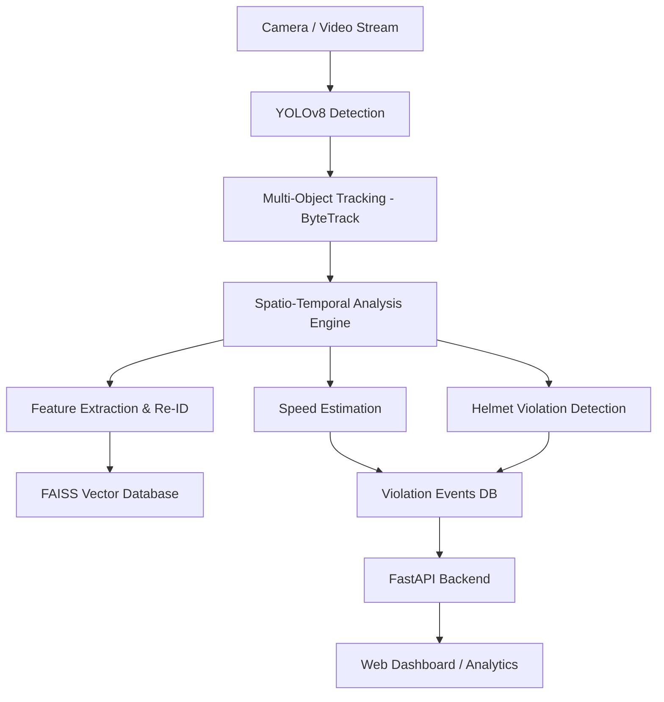
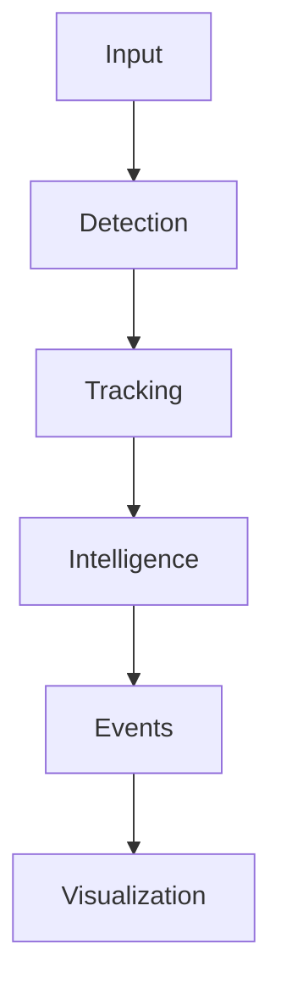

# 🧠 UrbanEye  
## Real-Time AI Traffic Intelligence for Safer, Smarter Cities 👁️🚦

> **UrbanEye** is an AI-powered, edge-deployable traffic surveillance system that automatically detects traffic violations, analyzes vehicle behavior, and generates actionable urban traffic intelligence — in real time.

---

## 🏷️ Badges

<div align="center">


</div>

---

## 📌 Overview

**UrbanEye** is a computer vision–based traffic intelligence platform designed for **real-world urban environments**, especially in developing regions where traffic is chaotic and infrastructure is limited.

### Who is it for?
- Municipal traffic departments
- Smart city initiatives
- Campuses, industrial zones, toll booths
- Researchers & AI engineers working on vision-based surveillance

### Why does it exist?
Existing traffic systems are:
- 💸 Extremely expensive
- ☁️ Cloud-dependent
- 👮 Heavily manual
- ❌ Not adaptable to real traffic conditions

**UrbanEye brings real-time, automated, privacy-aware traffic intelligence — running locally on affordable hardware.**

---

## ❌ Problem

Modern cities struggle with:
- Manual traffic violation monitoring
- Delayed enforcement and weak compliance
- Lack of real-time traffic analytics
- High dependency on proprietary, black-box systems

### Why current solutions fail:
- Require costly centralized infrastructure
- Do not scale to dense, unstructured traffic
- Poor accuracy in mixed vehicle environments
- No actionable intelligence beyond basic detection

---

## ✅ Solution

**UrbanEye introduces an edge-first, AI-driven traffic intelligence pipeline** that:

- Detects vehicles and pedestrians in real time
- Tracks objects across frames with consistent identities
- Estimates vehicle speed using trajectory analysis
- Detects violations like helmet non-compliance and overspeeding
- Enables cross-camera vehicle re-identification
- Provides actionable dashboards for traffic authorities

### What makes it different?
- 🧠 Spatio-temporal reasoning (not frame-by-frame rules)
- ⚡ Optimized for edge GPUs
- 🔐 Privacy-first design
- 🧩 Modular, extensible architecture
- 💯 100% open-source

---

## 🧠 Architecture

### High-Level System Design



---

### Data Flow:


---

## ✨ Features
- 🚗 Real-time vehicle & pedestrian detection
- 🧍 Multi-object tracking with persistent IDs
- ⏱️ Vehicle speed estimation via trajectory analysis
- 🪖 Helmet non-compliance detection (rider & pillion)
- 🔍 Vehicle re-identification across time and cameras
- 📊 Interactive traffic analytics dashboard
- 🔐 Privacy-aware processing (face/plate masking)

## 🛠️ Tech Stack
### Core
- Python 3.9+
- OpenCV
- NumPy

### AI / ML
- YOLOv8 (Ultralytics)
- PyTorch
- ByteTrack
- FAISS
- PaddleOCR / EasyOCR (planned)

### Backend
- FastAPI
- SQLite / DuckDB

### Frontend
- Dash & Plotly (Phase 1)
- React + Tailwind (Planned)

### Infra / DevOps
- Docker
- TensorRT (Planned)
- RTSP Streaming

  ---
  
## 📂 Project Structure
```
UrbanEye/
├── data/                  # Sample videos & datasets
├── models/                # YOLO & Re-ID model weights
├── src/
│   ├── detection/         # Object detection pipeline
│   ├── tracking/          # Multi-object tracking
│   ├── violations/        # Speed & helmet logic
│   ├── reid/              # Vehicle re-identification
│   ├── dashboard/         # Web UI
│   └── utils/             # Helper utilities
├── notebooks/             # Experiments & analysis
├── docker/                # Docker configuration
├── requirements.txt
└── README.md
```

---

## 💻 Installation
### Clone the Repository
```bash
git clone https://github.com/yourusername/UrbanEye.git
cd UrbanEye
```

### Create Virtual Environment
```bash
python -m venv venv
source venv/bin/activate    # Windows: venv\Scripts\activate
```

### Install Dependencies
```bash
pip install -r requirements.txt
```

### Download Model Weights
Download YOLOv8 weights and place them inside:
```bash
models/
```

### ▶️ Usage
### Run Detection Pipeline
``` bash
python src/detection/run_inference.py --video data/sample.mp4
```

### Start Dashboard
```bash
python src/dashboard/app.py
```

### Test Speed Estimation
```bash
python src/violations/speed_test.py
```

## ⚙️ Performance & Hardware
### Tested On:
- Lenovo LOQ
- NVIDIA RTX 4060 (8GB)
- 24GB RAM

| Metric          | Value        |
| --------------- | ------------ |
| Inference Speed | 30–45 FPS    |
| GPU Memory      | 4–6 GB       |
| Latency         | < 100 ms     |
| Deployment      | Edge / Local |

## 📊 Benchmarks

| Capability           | UrbanEye  | Traditional CCTV |
| -------------------- | --------  | ---------------- |
| Real-Time Detection  | ✅        | ❌              |
| Automated Violations | ✅        | ❌              |
| Re-ID Support        | ✅        | ❌              |
| Edge Deployment      | ✅        | ❌              |
| Cost                 | Free      | $$$              |

## 🗺️ Roadmap
- [ ] YOLOv8-based detection
- [ ] Multi-object tracking
- [ ] Speed estimation calibration
- [ ] Helmet detection (pose-based)
- [ ] License plate OCR
- [ ] React dashboard
- [ ] Near-miss & accident prediction

## 🎯 Vision
UrbanEye aims to become a plug-and-play AI traffic intelligence platform that:
- Runs on edge devices
- Respects citizen privacy
- Scales from single cameras to city-wide deployments
- Enables proactive traffic planning and enforcement

**Long-term goal:**
> Predict accidents before they happen.

## 🤝 Contributing
Contributions are welcome!
- Open issues
- Feature requests
- Pull requests
- Documentation improvements

## 📜 License
This project is licensed under the MIT License.

## 💡 Product Thinking
UrbanEye is designed as:
- Edge-first
- Modular
- Low-cost
- Research-driven
  
Built to solve **real urban problems**, not just showcase models.

If you like this project, ⭐ star the repo and join the journey.
