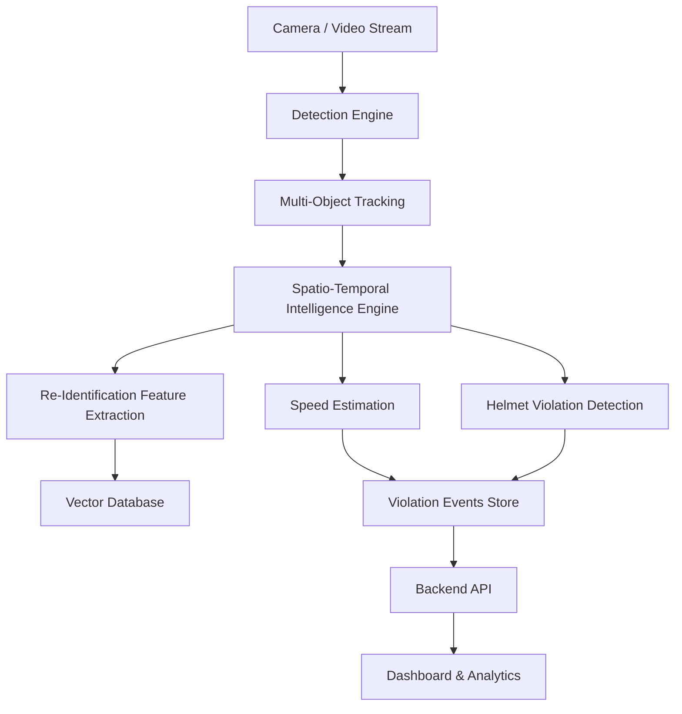
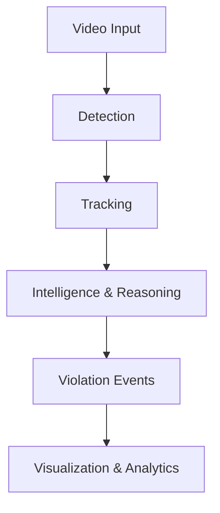
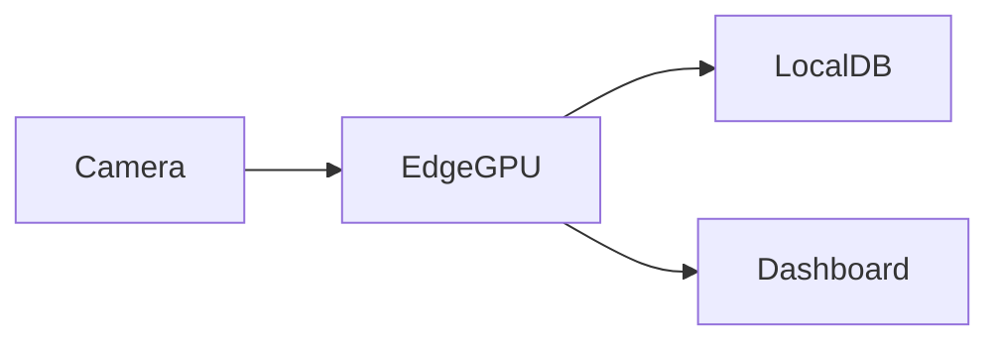

# 🧠 Traffyx-AI — System Architecture

Traffyx-AI is designed as an **edge-first, modular AI traffic intelligence system** that converts raw video streams into real-time, actionable traffic insights.

The architecture prioritizes:
- Low latency
- Privacy preservation
- Scalability across cameras
- Real-world robustness in unstructured traffic

---

## 🎯 Architectural Goals

1. **Edge-First Processing**
   - All core AI inference runs locally (GPU / edge device)
   - No mandatory cloud dependency

2. **Real-Time Intelligence**
   - Stream-based, low-latency pipeline
   - Sub-100 ms end-to-end delay target

3. **Modularity**
   - Detection, tracking, violations, and analytics are decoupled
   - Each module can evolve independently

4. **Privacy-Aware by Design**
   - No raw video storage by default
   - Optional face and license plate masking

---

## 🧩 High-Level System Overview



---

## 🔁 Data Flow Pipeline



---

## 🧠 Core Components

### 1️⃣ Video Ingestion Layer

**Responsibility**

* Accepts RTSP streams, video files, or camera feeds
* Handles frame sampling and buffering

**Key Characteristics**

* Configurable FPS
* Resolution normalization
* Camera calibration support (planned)

---

### 2️⃣ Detection Engine

**Purpose**

* Detect vehicles, pedestrians, riders, and helmets per frame

**Implementation**

* YOLOv8 (Ultralytics)
* GPU-accelerated inference
* Batched processing support

**Output**

```json
{
  "frame_id": 120,
  "detections": [
    {
      "class": "motorcycle",
      "bbox": [x1, y1, x2, y2],
      "confidence": 0.91
    }
  ]
}
```

---

### 3️⃣ Multi-Object Tracking

**Purpose**

* Assign persistent IDs to detected objects across frames

**Implementation**

* ByteTrack (IoU + confidence-based association)

**Why Tracking Matters**

* Enables speed estimation
* Enables violation history
* Enables behavior analysis

**Output**

```json
{
  "track_id": 42,
  "trajectory": [[x, y, t], ...]
}
```

---

### 4️⃣ Spatio-Temporal Intelligence Engine

This is the **core brain** of Traffyx-AI.

**Responsibilities**

* Maintain object histories
* Analyze trajectories over time
* Convert motion into semantic events

**Design Principle**

> Intelligence is derived from **time**, not single frames.

---

### 5️⃣ Violation Detection Modules

#### 🚗 Speed Estimation

* Uses object trajectories across calibrated distances
* Converts pixel displacement → real-world speed
* Supports per-lane calibration

#### 🪖 Helmet Non-Compliance

* Rider + pillion detection
* Helmet presence classification
* Rule-based + pose-aware logic (planned)

Each violation module:

* Consumes tracking data
* Emits structured events
* Is independently pluggable

---

### 6️⃣ Vehicle Re-Identification (Re-ID)

**Purpose**

* Identify the same vehicle across:

  * Time gaps
  * Different cameras

**Pipeline**

* CNN-based feature extraction
* Vector embeddings
* Similarity search using FAISS

**Use Cases**

* Cross-camera tracking
* Repeat offender detection
* Traffic flow analysis

---

### 7️⃣ Event Store

**Function**

* Stores only **metadata**, not raw video

**Typical Event**

```json
{
  "event_type": "overspeeding",
  "track_id": 42,
  "speed_kmph": 68,
  "timestamp": "2026-02-03T10:14:22"
}
```

**Storage**

* SQLite / DuckDB (local)
* Cloud sync optional (future)

---

### 8️⃣ Backend API Layer

**Framework**

* FastAPI

**Responsibilities**

* Serve violation data
* Provide analytics endpoints
* Manage system configuration

---

### 9️⃣ Dashboard & Visualization

**Phase 1**

* Dash + Plotly
* Real-time charts
* Violation logs

**Phase 2 (Planned)**

* React + Tailwind
* City-scale monitoring
* Role-based access

---

## 🔐 Privacy & Security Considerations

* No facial recognition
* Optional face / plate blurring
* Event-only storage by default
* Edge-local inference prevents mass surveillance misuse

---

## ⚙️ Deployment Architecture



**Supported Environments**

* Edge GPU (RTX / Jetson – planned)
* Local servers
* On-premise city deployments

---

## 📈 Scalability Strategy

| Dimension | Approach                           |
| --------- | ---------------------------------- |
| Cameras   | Horizontal scaling (per-edge node) |
| Models    | Hot-swappable inference modules    |
| Analytics | Aggregation layer (future)         |
| Storage   | Metadata-first, lightweight        |

---

## 🧠 Design Philosophy

Traffyx-AI is not just a detection system.

It is a **traffic intelligence engine** designed to:

* Understand motion
* Reason over time
* Assist human decision-makers

> Detection answers *what is visible*.
> Traffyx-AI answers *what is happening*.

---

## 🔮 Future Extensions

* Accident & near-miss prediction
* Multi-camera trajectory stitching
* Reinforcement learning for traffic optimization
* Integration with smart signals

---

**Architecture Status:** v0.1.0
**Last Updated:** Feb 2026